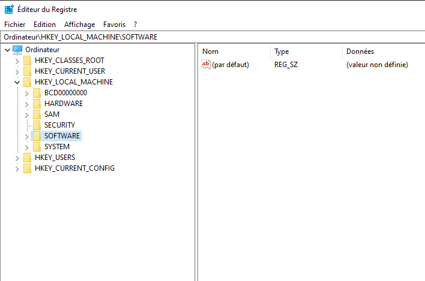
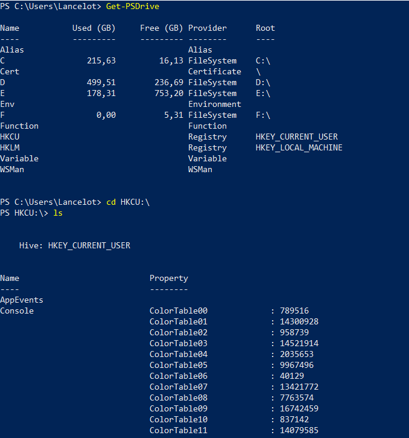
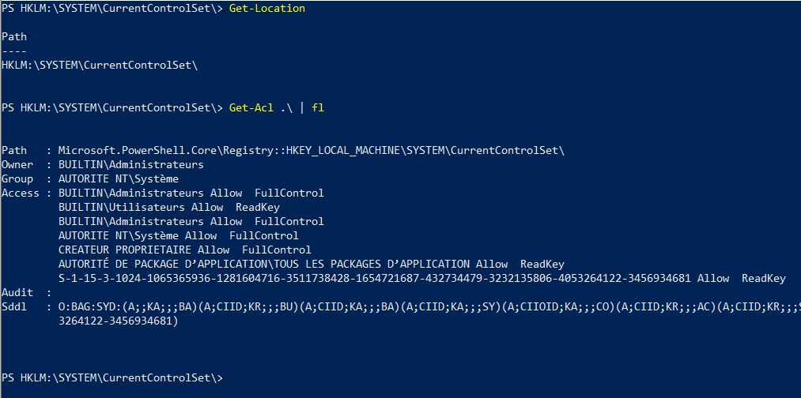
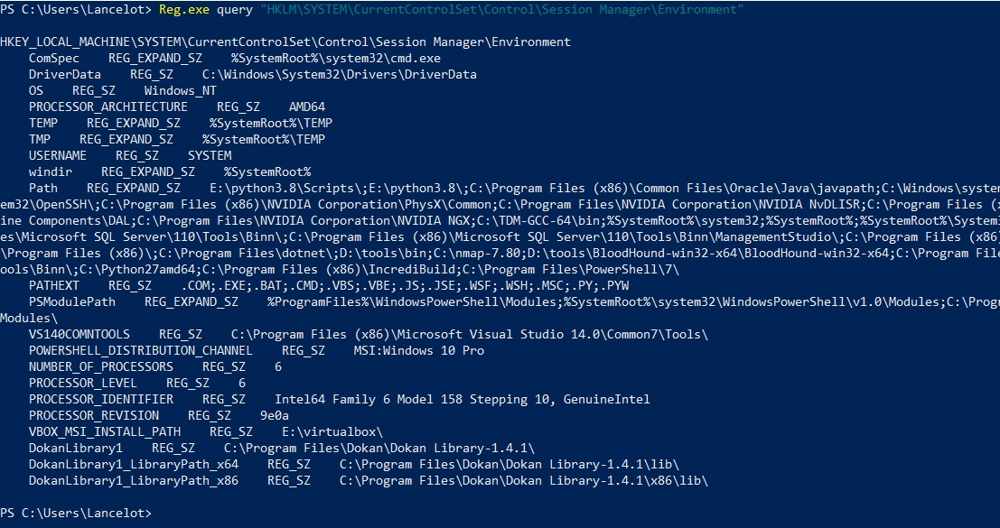
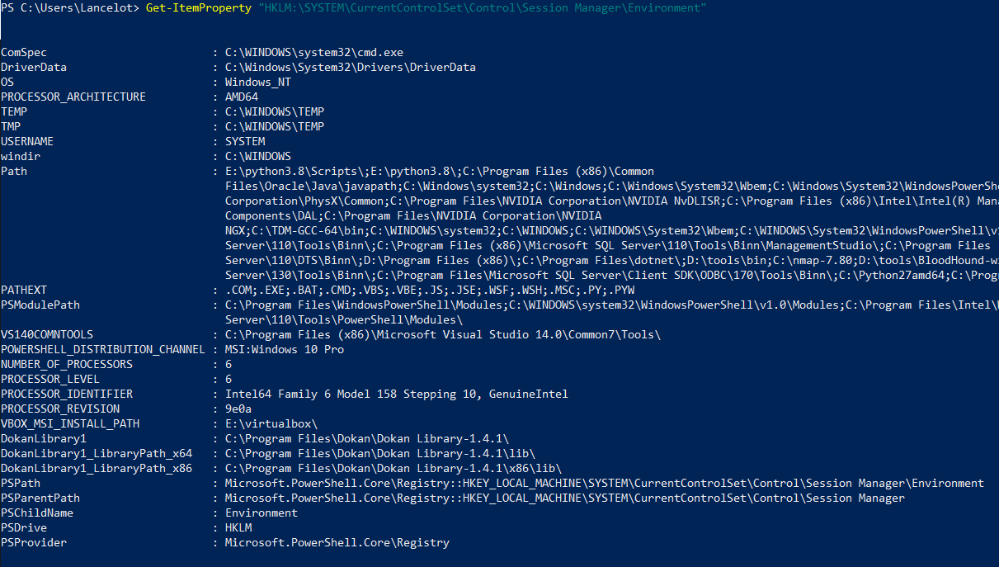
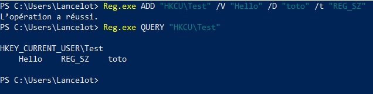
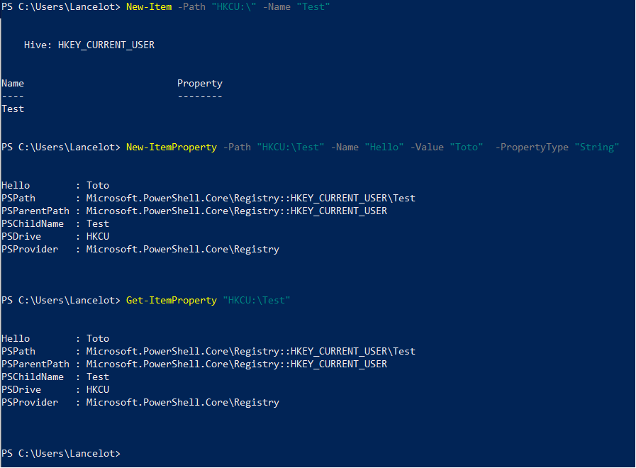

Author: Lancelot
Date: 2021/11/03
Keywords: windows, registre
Slug: registre
Summary: Sous Windows, les paramètres de l'OS sont sauvegardés dans les registres. Ces derniers sont vitaux pour le système et nous tacherons de les comprendre dans cet article.
Title: Les bases de registres Windows

Les registres Windows sont un composant vital du système d'exploitation. En effet, ils contiennent l'ensemble des paramètres que le système doit appliquer à chaque démarrage, mais exposent aussi des informations cruciales que certains programmes doivent pouvoir disposer. Dans cet article, nous explorerons le fonctionnement des registres Windows et des interactions élémentaires avec ceux-ci.

# Les registres, c'est quoi
Apparus en 1990 avec Windows 3.1 (et oui, c'est ancien), les bases de registres (en anglais "registry hives"), sont des bases de données hiérarchisées comportant l'ensemble des paramètres de Windows (bien que Microsoft préfère l'appellation registre Windows). Ainsi, ils fournissent un accès très rapide à un ensemble de fonctionnalités. À ce titre, nous retrouvons des informations sur les différents services présents sur le système, les applications installées, les utilisateurs du système, ou bien des paramètres de sécurité comme le mode de langage restreint de PowerShell. Par conséquent, il est possible de modifier le comportement de ces paramètres, en éditant les valeurs associées. Pour accéder aux registres de Windows, trois possibilités. La première, l'utilitaire regedit.exe, natif à l'OS, il propose une interface intuitive qui présente les chemins comme des arbres.

La seconde possibilité est d'accéder aux registres au moyen des APIs mises à disposition par Microsoft avec C/C++/C#. La dernière est l'accès avec une ligne de commande, principalement PowerShell (même si certains outils sont disponibles pour le CMD). En outre, pour naviguer au travers des différents espaces de stockage d'informations, PowerShell se base sur ce que l'on appelle des `PSDrive`. Ils sont une généralisation de ce qu'une invite de commande appelle disque, et peuvent contenir tous types d'informations. Ainsi, les disques physiques comme le `C:\`, les partages SMBs, des répertoires particuliers (par exemple `C:\Users\Lancelot`, le point bonus ici est que le `PSDrive` est cloisonné, on ne pourra pas aller en `C:\Users` dans ce cas), et les registres sont des éléments susceptibles d'être des `PSDrive`. La cmdlet `Get-PSDrive` vous informe des actuels `PSDrive` montés. Dans l'exemple ci-dessous, on utilise PowerShell pour se rendre dans la ruche `HKCU`.

Pour savoir ce que sont `HKCU` et` HKLM`, sont devons nous intéresser à la structure des registres.
# Architecture
Comme mentionné dans la partie précédente, les registres sont souvent présentés sous forme d'arborescence. A ce titre, on les identifie sous forme de chemin démarrant à une classe. Il en existe deux principaux:

- `HKLM`, pour `HKEY_LOCAL_MACHINE`, qui contient l'ensemble des paramètres du système d'exploitation. Cette classe est composée de plusieurs autres : `SAM` (pour "Security Account Manager") qui regroupe l'ensemble des paramètres de sécurité de l'OS, y compris les condensats de mots de passe des utilisateurs, `SOFTWARE` qui rassemble les informations sur les logiciels présents sur la machine, `SYSTEM` qui contient les paramètres du système d'exploitation tel que les configurations des différents services, et enfin `HARDWARE` qui expose les informations qui concernent le matériel physique de la machine, le type d'UEFI, le BIOS embarqué ou bien encore le processeur. Il est à noter que ces données sont écrites en `C:\Windows\System32\Config` par des fichiers nommés : `SAM`, `SOFTWARE`, `SYSTEM` (`HARDWARE` étant directement chargé en mémoire).
- `HKU`, pour `HKEY_USER`, contient l'ensemble des informations relatives aux différents utilisateurs enregistrés sur le système d'exploitation. Les différents SIDs par exemple (identifiants de sécurité unique), les dossiers de fichiers temporaires, le nom d'utilisateur, ou encore les paramètres de bureau et de l'UI. Cette classe est sauvegardée à différents endroits qui dépendent de l'utilisateur. En effet, en raison de sa nature, les données que HKU exhibe doivent être accessibles à l'utilisateur de notre session. Ainsi, la majeure partie des informations sont écrites dans `%USERPROFILE%\Ntuser.dat` (où `%USERPROFILE%` désigne le chemin vers le dossier courant de notre utilisateur).

Auxquelles viennent s'adjoindre un certain nombre d'autres classes, qui sont des raccourcis pour des sous-classes des deux premières:

- `HKCU`, `HKEY_CURRENT_USER`, est une sous-branche de `HKU` qui concerne l'utilisateur avec lequel notre session est enregistrée.
- `HKCC`, `HKEY_CURRENT_CONFIG`, est une sous-classe de `HKLM` (`HKLM\System\CurrentControlSet\Hardware Profiles\Current`) qui recense des informations sur le matériel physique actuellement utilisé et sa configuration.
- `HKCR`, `HKEY_CLASSES_ROOT`, est un mixe entre deux sous-classes de `HKLM` (`HKLM\Software\Classes` et `HKCU\Software\Classes`) qui contient les informations sur les applications enregistrées pour des tâches spécifiques, par exemple avec quoi ouvrir quel type de fichier (représenté par l'extension de celui-ci, sous Windows).
- `HKPD`, `HKEY_PERFORMANCE_DATA`, qui concentre les informations relatives aux performances des applications, programmes et autres en cours d'exécution. Cette classe n'est pas sauvegardée, les données sont collectées directement auprès des programmes. Cachée par regedit, cette classe reste néanmoins accessible à l'aide des APIs Windows.

Il en existe d'autres classes mais beaucoup plus anecdotique que vous pouvez trouver [ici](https://docs.microsoft.com/en-us/windows/win32/sysinfo/predefined-keys).

Les données contenues dans les registres doivent bien être écrites à un endroit. Si vous disposez de droits suffisant (l'accès Administrateur, ou bien des privilèges d'accès), vous pourrez les retrouver dans le `System32`. Si vous êtes plus un linuxien dans l'âme, vous pouvez comparer les registres Windows avec le dossier `/etc`. Toutes les classes ne sont pas enregistrées physiquement, mais si c'est le cas, elle est alors appelée "ruche" (de l'anglais "Hive"). Certains exemples sont donc évident d'après les informations que nous avons, `SYSTEM`, `SAM` sont des ruches.

Par la suite, on ajoute après des antislash les sous-classes, un peu comme les chemins de répertoires plus classiques pour Windows. Un chemin en entier est appelé clé. Alors une ou plusieurs valeurs y sont associées. Ainsi, les données sont structurées à l'aide de table, une clé, à laquelle on associe une ou plusieurs valeurs qui est d'un type particulier. Les types principaux étant les suivants:

- `REG_NONE`, indique une valeur inexistante.
- `REG_SZ`, est une chaîne de caractère (son encodage étant `UTF-16 LE` par défaut pour tous les systèmes Windows).
- `REG_EXPAND_SZ`, est une chaîne de caractère qui représente une variable d'environnement.
- `REG_BINARY`, une donnée en format binaire, quelle qu'elle soit.
- `REG_DWORD`, un nombre de 32 bits.
- `REG_LINK`, représente un lien symbolique vers une autre clé de registre.
- `REG_QWORD`, un nombre de 64 bits.

Bien sûr, pour des usages plus précis, il existe d'autres types que vous pouvez retrouver [ici](https://docs.microsoft.com/en-us/windows/win32/sysinfo/registry-value-types). De surcroît, parfois les clés contiennent d'autres clés qui sont alors appelées sous-clés.

D'un point de vue sécurité, il faut comprendre que les registres sont considérés, comme la quasi totalité des objets Windows, en tant que "Securable Object". Il en découle que des ACLs peuvent être placées pour restreindre les accès. Ainsi, il existe des privilèges qui permettent de modifier le comportement de sa session vis à vis des registres. Ces privilèges sont `SeRestorePrivilege` et `SeBackupPrivilege` qui permettent de lire et modifier sans permission des clés de registres ([pour plus d'informations](https://ilearned.eu.org/secu_windows.html)). Lorsqu'un utilisateur ne possède pas le droit de voir une classe ou une clé, elle apparaît vide de contenu dans `regedit.exe`, sinon c'est plutôt un beau message d'accès interdit !



# Fonctionnement

Lors du démarrage de Windows, le noyau du système va instancier et charger les différents registres (si la classe n'est pas une ruche, il va dynamiquement la créer, comme HARDWARE par exemple, si la classe est une ruche, les données seront simplement chargées des fichiers du disque). Puisque ces registres exposent des données relatives à la vie du système, le noyau va appliquer les configurations renseignées (ou les différents programmes démarrés comme `smss.exe`). Si par exemple un certain nombre de services sont enregistrés, alors le noyau les démarrera dans leur ordre d'importance et de vitalité. Lorsqu'un utilisateur se connecte, les informations de HKCU seront appliquées pour faire apparaître les icônes du bureau.

Les registres peuvent naturellement être modifiés,  en fonction du niveau de privilège de l'utilisateur (ou du programme). Pour reprendre un exemple précédemment cité, si un Administrateur souhaite ajouter des services à la machine (comme le démarrage d'applications de télémétrie à l'instar de Sysmon). Pour cela il existe un certain nombre d'options mais le plus pratique étant, les GPO (pour "Group Policy Object",  [j'ai écris un article à leur sujet](https://theredwindows.net/index.php/2020/09/24/utilisation-offensive-de-gpo-en-environnement-active-directory/)) qui permettent un déploiement large, rapide et efficace. Mais également, pour un usage plus individuel, avec les fichiers REG. Ces derniers sont des fichiers dont l'apparence est semblable au CSV. Ils possèdent la syntaxe suivante:
```
[Ruche\Clé\Sous-clé]
"nom de la clé"=<type de la valeur>:<valeur>
```

Lorsqu'ils sont exécutés, ils modifient les clés renseignées. Attention cependant, ils sont très répandu mais peuvent parfois contenir des malwares, alors prudence avant de les utiliser, surtout s'ils proviennent de sources inconnues. Pour accéder en ligne de commande aux registres, vous pouvez utiliser l'utilitaire `Reg.exe` depuis l'invite de commande ou PowerShell. La syntaxe est assez simple, mais elle nécessite que vous possédiez le chemin complet de la clé. Voici un exemple assez modeste qui montre les variables d'environnement par défaut de tous les utilisateurs.

Il est également possible d'utiliser les Cmdlets natives à PowerShell, celles prédestinées à cette usage étant `Get-Item/Get-ItemProperty`:

Aussi, vous pouvez vous placer dans le `PSDrive` du registre, et vous pourrez naviguer dans celui-ci exactement comme si vous étiez dans un dossier !

Pour créer une clé, on peut utiliser `Reg.exe` de la manière suivante:
```
Reg.exe ADD [Clé] /V [nom de la valeur] /d [données associées] /t [type]
```
Par exemple ajoutons la valeur Hello de type `REG_SZ` contenant "toto" à la clé `HCKU\Test`:

Nous pouvons faire de même avec PowerShell. En premier lieu, nous créons la clé avec `New-Item`, puis on ajoute la valeur avec `New-ItemProperty`:

Pour modifier une clé. Avec `Reg.exe` on fait comme si nous voulions créer une nouvelle clé, et on ajoute le flag `/f` pour forcer la réécriture de la clé. Avec PowerShell, rien de plus simple, on utilise la Cmdlet `Set-ItemProperty`:
```
Set-ItemProperty -Path "HKCU:\Test" -Name "Hello" -Value "hey"
```
Attention cependant, car le type de la valeur sera inchangé. S'il faut le changer, on supprime la clé et on la refait.

Pour supprimer une clé avec Reg.exe, rien de plus simple:
```
 Reg.exe DELETE [Chemin de la clé] 
 ```
 Avec PowerShell on utilise `Remove-Item` !

Évidemment, les exemples ici sont volontairement simplistes, et un usage bien plus avancé de ces outils est possible.
# Conclusion

Cet article touche à sa fin, j'espère que cet article vous aura plu et aura permis d'apporter des lumières sur les zones d'ombres que pouvaient représenter les registres Windows. Si l'univers de l'OS de Microsoft et sa sécurité vous intéresse, n'hésitez à aller consulter [mon blog](https://theredwindows.net) ou bien les autres articles [que j'ai publiés sur I Learned](https://ilearned.eu.org/author/lancelot.html) !
