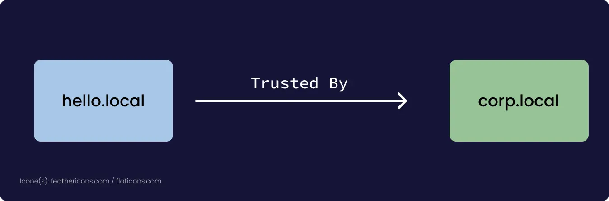

Author: Lancelot 
Date: 2021/12/15
Keywords: Windows, réseau
Slug: ActiveDirectory
Summary: Active Directory est un système au cœur des réseaux Windows et ce depuis 1996. Véritable incontournable de la sécurité informatique, il est devenu en quelques années une cible de choix pour les attaquants. Mais avant tout, il est nécessaire de comprendre ce qu’il est. Cet article destiné aux néophytes présentera, sans entrer dans trop de détails, comment il fonctionne.
Title: C'est quoi un Active Directory

# C'est quoi un Active Directory
Active Directory est un système au cœur des réseaux Windows et ce depuis 1996. Véritable incontournable de la sécurité informatique, il est devenu en quelques années une cible de choix pour les attaquants. Mais avant tout, il est nécessaire de comprendre ce qu’il est. Cet article destiné aux néophytes présentera, sans entrer dans trop de détails, comment il fonctionne.

## Composants

Un active Directory est composé de trois services principaux :

- Un DNS intégré.
- Un serveur Kerberos.
- Un serveur LDAP.

Le premier permet d’identifier clairement les machines dans un Active Directory en leur attribuant un nom. Ce nom dérive du nom du domaine, spécifié lors de la création d’un Active Directory (`testlab.local` par exemple) 

Le second est un élément clé. En effet Kerberos permet d’authentifier les différents objets du domaine. Pour cela il procède par un système d’échange de tickets en 3 étapes, pour obtenir le ticket principal d’accès nommé `TGT` ("Ticket Granting Ticket"). En premier lieu, l’utilisateur par exemple, va effectuer une demande de d’authentification (`KRB_AS_REQ`) auprès du serveur d’authentification appelé KDC pour Key Distribution Center. Cette demande contient entre autres le hash NT (dans le langage de Kerberos il est aussi appelé RC4) de l’utilisateur, qui est un hash de son mot de passe (si vous voulez plus de détails sur l’algorithme utilisé, la fin de  [cet article vous éclairera](https://ilearned.eu/hashage.html)). Puis ce dernier va retourner une réponse nommée `AS_REP` dans le cas où les identifiants sont valides, et cette réponse contiendra le `TGT`. Une fois ce fameux `TGT` obtenu, un utilisateur (ou une machine) s’en sert pour acquérir des `TGS` ("Ticket Granting Service") qui garantissent l’accès à un service sur une autre machine de l’environnement. Ces différents tickets ont un certain temps limite d’utilisation, une sorte de date de péremption qui est soigneusement réglée dans les paramètres de l’Active Directory. Pour ceux qui souhaiteraient plus de détails, je recommande chaudement  [cette article de Pixis](https://beta.hackndo.com/kerberos/).

  

Le dernier élément est l’annuaire LDAP. Son rôle est aussi crucial que le second. Il centralise la base de données contenant tous les objets de l’Active Directory. Ainsi, il possède une architecture similaire à une arborescence partant de l’élément centrale de tout Active Directory, le domaine qui est traité en tant qu’objet (pour un domaine nommé `testlab.local`, l’arbre commence à `DC=testlab,DC=lab`). Chaque objet possède des propriétés qui sont exposées dans l’annuaire. Ainsi, il est une mine d’informations gigantesque et expose toutes les données nécessaires au bon fonctionnement de l’environnement. Que ce soient les GPOs qui sont en application sur le domaine, des ordinateurs ou d’autres objets. Entre ces derniers, il existe des relations de privilèges et de droits, qui sont des prolongements des ACLs et ACEs du modèle de sécurité de Windows (si ça vous dis rien, j’ai écris un article sur  [le sujet sur le blog de I Learned](https://ilearned.eu/secu_windows.html)).

Ces services sont assurés par par un contrôleur de domaine qui est le cœur de l’environnement Active Directory. C’est à partir de lui qu’on déploie l’environnement.

## Extension des domaines

Il existe une série de fonctionnalités très intéressantes qui sont mises à disposition par Active Directory. En premier lieu, les Contrôleurs de Domaine possèdent des rôles spécifiques (appelés FSMO). Chaque rôle leur permet d’assurer l’exposition d’un service clé, mais en plus avec un certain nombre de privilèges. Par exemple, l’un des rôles est le KDC que nous avons déjà vue, mais il en existe 4 autres que  [vous pouvez retrouver ici](https://www.it-connect.fr/chapitres/les-cinq-roles-fsmo/). La répartition de ces rôles permet un bénéfice énorme, un environnement Active Directory peut posséder plusieurs contrôleurs de domaine. Cela permet une plus grande souplesse en terme d’architecture (mais peut exposer dans le même temps plus de points faibles). En second lieu, pour que plusieurs domaines interagissent entre eux, il convient d’appliquer des « relations de confiances » entre ces domaines. De manière grossière, ils accordent aux utilisateurs certains droits dans un autre domaine (comme la lecture de l’annuaire). À remarquer qu’il n’est pas nécessaire que ces domaines aient une chose en commun, ils peuvent être différents en tous points. 

Il devient alors possible de combiner plusieurs domaines entre eux en un tout unique descendant d’un objet central. C’est ainsi que naissent les forêts. Par conséquent, il faut les voir comme des sortes « d’Active Directory d’Active Directory » où un domaine principal contient plusieurs sous-domaines enfants, donc différentes relations de confiances sont présentes entre ces différents sous-domaines. Les domaines deviennent donc des objets comme les utilisateurs par exemple, et des politiques très générales d’encadrement peuvent être déployées de manière très efficiente. Les ressources entre domaines différents sont désormais partagées, et des rôles de pouvoir spécifiques se mettent en place. L’exemple le plus flagrant est celui de l’Administrateur. En outre, dans un domaine unique, ce dernier est membre de trois groupes différents, bien sur, le groupe d’administrateurs local du contrôleur de domaine, le groupe « Domain Admins » et enfin le groupe « Enterprise Admins ». Ces deux groupes renvoient à deux choses différentes. Le premier concerne le domaine uniquement, alors que le second concerne la forêt dans son entièreté. Lorsque nous sommes dans une forêt, les mécanismes qui entrent en jeux sont les mêmes que dans un domaine, à la différence près que des objets d’un domaine externe peuvent interagir avec d’autres domaines. Ainsi, l’authentification Kerberos est partagée, et il en va de même pour l’annuaire LDAP.

## Vers plus de Cloud

L’une des plus grosses modifications récentes à cette architecture, est l’apport du Cloud. Le Cloud est une technologie révolutionnaire dans bien des domaines, entre autre le déploiement large de services et leur décentralisation, l’automatisation de plus en plus de tâches grâce au DevOps. C’est dans cette optique que Microsoft a pensé son infrastructure de Cloud nommé Azure. Bien sûr, comme à son habitude, Microsoft l’implémente à toutes les sauces, en premier lieu avec le DevOps (les pipelines Azure) et le stockage de données. Mais ils s’en sont également servi pour moderniser Active Directory en introduisant Azure Active Directory. Le concept en lui-même n’est pas bien différent de l’Active Directory standard, mais certains points de différences subsistent. Il n’y a plus de groupes mais des rôles, et les privilèges sont remplacés. Ils introduisent une décentralisation des applications notamment, et il existe un lien très fort entre un Active Directory standard et un Azure Active Directory, en outre ils peuvent être liés entre eux dans un même environnement.

## Conclusion

J'espère que cet article vous a plu, si vous souhaitez aller plus loin, il existe énormément de ressources différentes, je pense notamment aux vidéos de Processus Thief, le blog de Pixis et de inf0sec (et éventuellement le mien) !