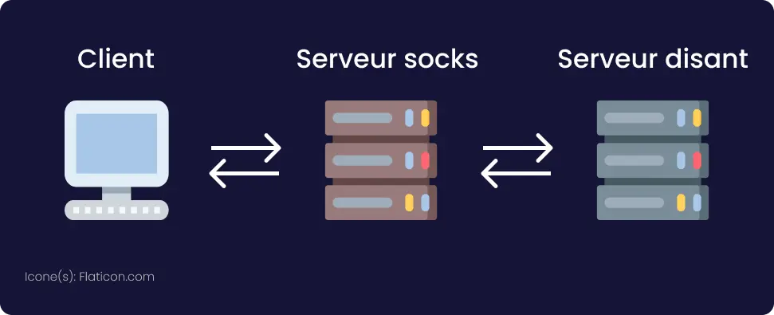

lang: fr
Author: Ownesis
Date: 2021/10/02
Keywords: socks, tor, proxy, protocole, tcp, udp, header
Slug: socks
Summary: Dans cet article, nous allons voir ce qu'est le protocole SOCKS, les versions qu'il a connues, comprendre son fonctionnement, son utilité et comment l'utiliser.
Title: Tout savoir sur le protocole SOCKS
Category: Réseau/Proxy & VPN

Le protocole
Socks est un protocole réseau qui permet à un `client` de faire transiter ses données par un `serveur`.
D'après le modèle OSI, le protocole SOCKS est une couche intermédiaire entre la couche applicative et la couche transport, donc il "commencerait" couche 5 (session).  
Le client, *qu'on verra plus tard*, peut faire passer dans le socket tout protocole au dessus de la couche de transport (TCP ou UDP).
Donc, HTTP(S),  FTP(S), SSH, DNS, et j'en passe.

## Version 4
La version 4 de socks ne supporte que le protocole TCP et l'IPv4.
Il propose au client de se connecter à un serveur distant et prend en charge une possible connexion entrante **après** une connexion déja établie (comme pour FTP).

Voici la [RFC](https://www.openssh.com/txt/socks4.protocol) de cette version du protocole.

### Header CONNECT et BIND

- **Requete**

		+----+----+----+----+----+----+----+----+----+----+....+----+
		| VN | CD | DSTPORT |      DSTIP        | USERID       |NULL|
		+----+----+----+----+----+----+----+----+----+----+....+----+
           1    1      2              4           variable       1

	- `VN` est la version de SOCKS (`4`).
	- `CD` Indique le "type" de conexion:
		- `1` CONNECT
		- `2` BIND
	- `DSTPORT` Indique le port distant à contacter.
	-  `DSTIP` Indique l'IPv4 du serveur distant à contacter.
	-  `UERID` Peut être tout est n'importe quoi, `tsocks` (un client socks) y met le nom d'utilisateur.
	- `NULL` Est un octet NULL `0`, il indique la fin de `USERID`

- **Reponse**

		+----+----+----+----+----+----+----+----+
		| VN | CD | DSTPORT |      DSTIP        |
		+----+----+----+----+----+----+----+----+
          1    1      2              4

	- `VN` Correspond à la version de code de réponse, il doit être mit à `0`.
	- `CD` Correspond à un code de resultats:
		- `90` : demande acceptée.
	 	- `91` : demande rejetée ou échouée.
	 	- `92` : demande rejetée car le serveur SOCKS ne peut pas se connecter à [`identd`](https://en.wikipedia.org/wiki/Ident_protocol) sur le client.
	 	- `93` : demande rejetée car le programme client et identd signaler des identifiants différents.
	- `DSPORT` est  ignoré pour `CONNECT`, mais pour `BIND` cela correspond au port mis en écoute par le serveur socks.
	- `DSTIP` est ignoré pour `CONNECT`, mais pour `BIND` cela correpond à l'ip utilisé par le serveur socks qui attend la connexion.

Le type de connexion `BIND` devrait être envoyé seulement après une connexion de type `CONNECT`, ceci est utilisé par les services qui utilisent le "multiple connexion", par exemple lors d'une connexion FTP en mode "active", quand le client écoute sur un port pour recevoir les données.
Cette option permet donc de ne pas créer de connexions direct entre le serveur et le client.

## Version 4a
La version 4a de socks est une *mini* update de la version 4 avec une bonne idée mais mal implémenté (je trouve).

Voici sa [RFC](https://www.openssh.com/txt/socks4a.protocol).

Cette nouvelle version ajoute la possibilité de donner au serveur un nom de domaine au lieu d'une adresse IP, et c'est le serveur socks qui doit lui même résoudre le nom de domaine.

Sur le papier c'est cool. L'implémentation c'est une autre histoire.

De ce que j'ai compris, pour envoyer un nom de domaine, il faut mettre les 3 premiers octets du champ `DSTIP` à `0` et le 4 ème octet doit être une valeur non `NULL` donc tout sauf `0`.

Exemple:
Une adresse IP sous forme "texte" donnerait: `0.0.0.42`.
En représentation décimale, *(c'est comme ça que devra être représentée l'adresse IP dans le champ `DSTIP`)* cela donnerait `42` tout simplement.

> *Pour en savoir plus sur la représentation décimale d'une adresse IP, j'en parle dans cette [article](https://ilearned.eu.org/ipv4-header.html)*

Cette IPv4 est bien entendue invalide, et le serveur "comprend" qu'il doit lui même résoudre un nom de domaine.
> mais... ou mettons-nous ce nom de domaine ?!

On le met après l'octet `NULL` qui termine le nom d'utilisateur, et on rajoute un octet `NULL` à la fin du nom de domaine.

C'est fastidieux je vous l'accorde, mais heureusement la version 5 de socks implémente cette idée d'une bien meilleure façon, et bien plus encore.

## Version 5
La version 5 de socks, rajoute d'autres fonctionnalités au protocole comme:

- De nouvelles méthodes d'authentification.
- Le support d'IPv6.
- Un VRAI support des noms de domaine.
- La prise en charge d'UDP.

Voici sa [RFC](https://datatracker.ietf.org/doc/html/rfc1928).

Contrairement à la version 4 et 4a de socks, socks5 établit une sorte de "handshake" avec le serveur.
Voici comment ça se passe:

1. Le client se connecte et envoie une annonce qui inclut une liste de méthodes d'authentification qu'il supporte.
2. Le serveur choisit l'une de ces méthodes ou envoie une erreur si aucune méthode n'est acceptable.
3. Plusieurs messages sont alors échangés selon la méthode d'authentification choisi.
4. Une fois authentifié, le client envoie une requête de connexion assez similaire du protocole SOCKS v4(a).
5. Le serveur répond d'une manière similaire à SOCKS v4.

### Header AUTH

- **Requete**

		+----+-----------+----------+
		|VER | NMETHODES | METHODES |
		+----+-----------+----------+
		| 1  |    1      |  1 à 255 |
		+----+-----------+----------+

	- `VER`, Correspond à la version socks (`5`).
	- `NMETHODES`, Correspond aux nombres de methodes d'authentification que le client supporte.
	- `METHODES`, Correspond aux methodes d'authentification que le client supporte.
		- `0x00`: Pas d’authentification exigée.
		- `0x01`: GSSAPI
		- `0x02`: Nom d’utilisateur/mot de passe.
		- `0x03` à `0x7F`: Alloué par l’IANA.
		- `0x80` à `0xFE`: Réservé pour des méthodes privées.
		- `0xFF`: Pas de méthode acceptable.

- **Reponse**

		+----+---------+
		|VER | METHODE |
		+----+---------+
		| 1  |   1     |
		+----+---------+
	- `VER`, Correspond à la version de socks: (`5`).
	- `METHODE`, Correspond à la methode choisi par le serveur socks. 		

### Header connexion
- **Request**

		+----+-----+-------+------+----------+----------+
		|VER | CMD |  RSV  | ATYP | DST.ADDR | DST.PORT |
		+----+-----+-------+------+----------+----------+
		| 1  |  1  | X'00' |  1   | Variable |    2     |
		+----+-----+-------+------+----------+----------+
	- `VER`: Version du protocole : `5`.
	- `CMD` : Commande:
		- `01` CONNECT.
		- `02` BIND.
		- `03` UDP ASSOCIATE.
	- `RSV`: Réservé (`0x0`).
	- `ATYP`: Type d’adresse de `DST.ADDR`:
		- `0x01`: IPv4.
		- `0x03`: Nom de domaine.
		- `0x04`: IPv6.
	- `DST.ADDR`: Adresse de destination désirée.
	- `DST.PORT`: Port de destination désiré.

- **Reponse**

		+----+-----+-------+------+----------+----------+
		|VER | REP |  RSV  | ATYP | BND.ADDR | BND.PORT |
		+----+-----+-------+------+----------+----------+
		| 1  |  1  | X'00' |  1   | Variable |    2     |
		+----+-----+-------+------+----------+----------+

	- `VER`: Version du protocole (`5`).
	- `REP`: Champ de réponse.
		- `0x00` Succès.
		- `0x01` Echec général du serveur SOCKS.
		- `0x02` Connexion interdite par les règles.
		- `0x03` Réseau injoignable.
		- `0x04` Hôte injoignable.
		- `0x05` Connexion refusée.
		- `0x06` TTL expiré.
		- `0x07` Commande non acceptée.
		- `0x08` Type d’adresse non acceptée.
		- `0x09` à `FF`: Non alloué.
	- `RSV`: Réservé (`0x0`).
	- `ATYP`: Type d’adresse de l’adresse dans le champ suivant:
		- `0x01`: Adresse IPv4.
		- `0x03`: Nom de domaine.
		- `0x04`: Adresse IPv6
	- `BND.ADDR`: Adresse du serveur connectée.
	- `BND.PORT`: Port du serveur connectée.

### Header UDP
 - **Requete et Reponse**

		+----+------+------+----------+----------+----------+
		|RSV | FRAG | ATYP | DST.ADDR | DST.PORT |   DATA   |
		+----+------+------+----------+----------+----------+
		| 2  |  1   |  1   | Variable |    2     | Variable |
		+----+------+------+----------+----------+----------+

	- `RSV`: Réservé (`0x0`).
	-  `FRAG`: Numéro du fragment actuel.
	- `ATYP`: Type d’adresse:
		- `0x01`: IPv4.
		- `0x03`: Nom de domaine.
		- `0x04`: IPv6.
	- `DST.ADDR`: Adresse de destination désirée.
	- `DST.PORT`: Port de destination désiré.
	- `DATA`: Données à envoyer.

# Le serveur
Le serveur socks c'est le serveur "intermédiaire" qui sera entre le client et le serveur distant il écoute principalement sur le port 1080 (TCP et UDP).

Il fonctionne comme suit:

Exemple (TCP):

- Le serveur socks accepte la connexion du client.
- Il récupère l'ip/domaine et le port du serveur distant que le client lui envoie.
- Le serveur socks établie une nouvelle connexion avec le serveur distant.

De ce fait, le serveur socks est un proxy/intermédiaire entre le client et le serveur distant, donc tout ce que le client envoie au serveur socks, le serveur socks l'envoie au serveur distant, et inversement.

Pour UDP c'est la même chose, sauf qu'il n'y a pas de "connexion" à proprement parler (voir cet [article](https://ilearned.eu.org/udp.html) pour plus de détails par rapport à UDP), il y'a un header précis pour UDP et le client envoie ce header au serveur socks, et en cas de réponse, le serveur socks envoie ce header aussi au client (avec les données "réponse").

Il est aussi tout à fait possible de demander à un serveur socks de se connecter à un autre serveur socks, c'est ce qu'on appelle une chaine de proxy, et c'est le principe du réseau Tor (le réseau anonyme qui aura son article dédié bientôt) qui utilise le protocole SOCKSv5 et utilise une chaine de proxy pour faire transiter les requêtes du client.

SSH permet aussi la mise en place d'un serveur socks, avec l'argument `-D`.

Exemple:
sur la machine `iusearchbtw` j'execute cette commande:

`[ownesis@iusearchbtw ~]$ ssh ownesis@socks.example.com -D 9090 -N`.

Cela ouvre  le  port `9090` sur la machine `iusearchbtw` et si j'accède à `localhost:9090` sur la dite machine, les données seront transitées vers `socks.example.com` (qui sera utilisé comme serveur socks) qui relayera ensuite les données vers le serveur cible.

Il existe l'outil [microsocks](https://github.com/rofl0r/microsocks) écrit en **C** qui permet de mettre en place un serveur socks5 facilement.

# Le client
Le client socks, comme son nom l'indique, c'est celui qui contactera le serveur socks, c'est l'application qui se connecte au serveur socks et qui dit à ce dernier d'établir une connexion avec un serveur distant.

C'est rare de trouver des clients socks comme ça "native", c'est généralement une "option" à une application. Par exemple, `curl` a une option `--socks5` permettant de passer par un serveur socks5.
Il existe aussi des "wrapper" socks, par exemple : `torsocks`, `tsocks` ou `proxychains-ng`, ces outils permettent de faire passer toutes les connexions TCP ou UDP du programme appelé, par un serveur socks.

Exemple:

Cette commande utilisant `curl` permet de contacter `mikadmin.fr` à travers `localhost:9090` (`localhost` ayant un serveur socks écoutant sur le port `9090` comme vu dans la section **serveur**)

`[ownesis@iusearchbtw ~]$ curl --socks5 localhost:9090 mikadmin.fr`.

Cette seconde commande utilisant le wrapper `proxychains` permet d'utiliser le programme `telnet` pour se connecter à `telehack.com` sur le port `23` à travers un ou plusieurs serveurs socks.

`[ownesis@iusearchbtw ~]$ proxychains telnet telehack.com `

*ici on ne précise pas de serveur socks car il est dans un fichier de configuration: `/etc/proxychains.conf`*

# Conclusion
- Le protocole SOCKS est un protocole permettant de contacter un serveur et/ou client socks.
- La dernière version du protocole SOCKS est la v5
- Le protocole socks se trouve sur la couche 5 du modèle OSI, (il est par dessus TCP/UDP).
- Un serveur SOCKS se place entre le client et un serveur distant, il joue le rôle de proxy. Il envoie au serveur distant ce que le client envoie et inversement.
