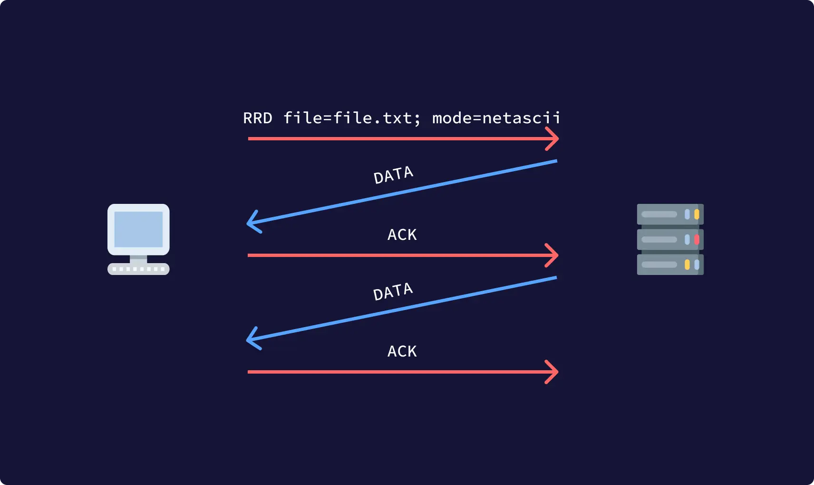

lang: fr
Title: TFTP, présentation et aperçu d'un protocole simple de transfert de fichier.
Keywords: UDP, FTP, Application, Transfert de fichier, File Transfer Protocol
Date: 2021-12-09
Author: Ownesis
Summary: Dans cet article, nous allons voir ensemble ce que propose la protocole TFTP à quoi il sert et comment fonctionne-t-il.
Slug: tftp
Category: Sysadmin

Aujourd'hui je vais vous présenter et vous parlez du protocole **TFTP**.
J'imagine que vous pensez tout de suite au protocole **FTP**, et vous avez raison.
**TFTP** signifie **T**rivial **F**ile **T**ransfer **P**rotocol.

> Mais qu'est ce qu'il rajoute à FTP ?

Qu'est-ce qu'il enlève de FTP voulez-vous dire ? :eyes:

Oui, vous avez bien lu, **TFTP**, même si celui ci rajoute une lettre au protocole **FTP**, il retire une "plus ou moins importante" fonctionnalité a ce dernier.
Il n'est pas possible d'exécuter des commandes, comme lister les fichiers, changer les droits des fichiers,  se déplacer dans le système de fichier, etc.
**TFTP** permet seulement de lire ou écrire sur le serveur distant, autrement dit, il permet seulement de récupérer ou envoyer (voir en créer dans certain cas) des fichiers (ou des courriers).
Autre chose importante à savoir, il n'y a pas d'authentification des utilisateurs.
Bon, vous l'aurez deviné, **TFTP** est un protocole de la [couche application](https://fr.wikipedia.org/wiki/Couche_application), il faut donc permettre le transport et c'est avec le protocole [**UDP**](https://ilearned.eu/udp.html) que cela ce fait.

On utilise le protocole **TFTP** notamment pour la mise à jour des firmwares sur les équipements réseaux, la sauvegarde de la configuration de ces équipements réseau, mais aussi pour amorcer des stations de travail sans disque dur.
C'en est tout pour la présentation de **TFTP**.

Maintenant rentrons dans le vif du sujet, voyons comment le protocole fonctionne :
Pour commencer, le client demande une connexion au serveur **TFTP**, dans cette demande de connexion, le client précise si c'est pour de la lecture ou d'écriture de fichier.
Le serveur accepte ou non la demande, si le serveur accepte, la connexion est de ce fait "ouverte" et le partage du fichier peut avoir lieu. Le bloc de donnée utilisé pour envoyer le fichier, que ce soit du côté client ou serveur, est d'une taille fixée à `512 octets`, chaque paquet contient un bloc de données et doit être acquitté par un paquet d'accusé de réception avant l'envoie d'un prochain paquet.
Pour signaler la fin d'un transfert, un paquet de données d'une taille **inférieur** à `512 octects` doit être envoyé.

Si le client demande une connexion pour lire un fichier, il envoie l'OPcode `RRQ` ou  l'OPcode `WRQ` pour écrire, le serveur envoie ensuite une réponse "positive", un accusé de réception pour acquitté la demande du client (si la demande est pour lire, le serveur envoie directement le bloc de données comme accusé de réception).
Si un paquet se perd dans le réseau, le receveur sera alors mis en "timeout" et l'envoyeur devra réenvoyer le paquet.
En général, un paquet d'accusé de réception contiendra le numéro de bloc du paquet de données reçu.
Chaque paquet de données est associé à un numéro de bloc.
Les numéros de bloc sont consécutives et le premier commence à `1`.
Lors d'une demande d'écriture (OPcode `WRQ`), l'accusé de réception à cette demande aura comme numéro de bloc de donnée `0`.

Lors d'une création de connexion, chaque extrémité de la connexion choisit un **TID** (**T**ransfer **ID**), une identification de transfert donc, pour lui-même.
Les **TID** doivent être choisis au hasard.
Chaque paquet est associé aux deux **TID** des extrémités de la connexion, le **TID** source et de destination.
Ces **TID** sont remis à **UDP** comme ports source et destination.
Le client, choisis sont **TID** (le port UDP) comme décrit ci-dessus et envoie sa requête initiale au **TID** `69` du serveur.

> Vous l'aurez compris, le serveur **TFTP** écoute de base sur le port `69`.

Lors de la réponse à la demande de connexion du client, le serveur choisis un **TID** (un autre port source), qui sera utilisé pour le reste de l'échange.
À ce moment les deux extrémités de la connexion ont leurs propres **TID** et l'échange pour ce faire.
Les hôtes doivent s'assurer que le **TID** source correspond toujours aux **TID** choisis.
Si un **TID** ne correspond pas, le paquet doit être rejeté et un paquet d'erreur doit être envoyé à la source du paquet incorrect, sans perturber le transfert.

## Paquet TFTP

**TFTP** prend en charge `5` types de paquets (OPcode) codé sur `2 octets`, les voici:
 - `0x0001` **RRQ**  (Demande de lecture)
 - `0x0002` **WRQ**  (Demande d'écriture)
 - `0x0003` **DATA** (Données)
 - `0x0004` **ACK**  (Accusé de réception)
 - `0x0005` **ERR**  (Erreur)

### Paquet de demande de lecture ou d'écriture
Le paquet `RRQ/RWQ` ressemble à ceci :


 - **OPcode**: `2 octets` (`0x0001` **RRQ** ou `0x0002` **RWQ**).
 - **Nom de fichier** : Taille variable, il correspond au nom/chemin du fichier.
 - **0**: `1 octet`, correspond à la fin de la chaine de caractère désignant le fichier.
 - **Mode**: Taille variable, voici les différents modes (insensible à la casse) :
    - 'netascii'
    - 'octet'
    - 'mail' (obsolète)
 - **0**: `1 octet`, correspond à la fin de la chaine de caractère désignant le **Mode**.

L'hôte qui reçoit le mode `netascii`, doit "traduire" les données dans son propre format (en modifiant la fin de ligne \r\n ou \n ou \n\r, ...)
Le mode `octet` permet d'envoyer le fichier "tel quel".

### Paquet de Données
Le paquet de Données (**DATA**) ressemble à ceci :


 - **OPcode**: `2 octets` (est mis à `0x0003` **DATA**).
 - **# de bloc**: `2octets` Numéro de bloc.
 - **Données**: Taille variable, ce sont les données à envoyer

Le numéro de bloc commence à `1` et est incrémenté à chaque envoi.
La taille des données est limité à un maximum de `512 octets`, si le paquet de données n'est pas le premier et que la taille de la donnée et inférieur à `512 octets`, cela correspond à la fin du fichier et du transfert.

### Paquet d'acquittement
Le paquet d'accusé de réception (**ACK**) ressemble à ceci :


 - **OPcode**: `2 octets` (est mis à `0x0004` **ACK**).
 - **# de bloc**: `2 octets`, correspond au numéro de bloc reçu.

Si la demande du client est une demande d'écriture (OPcode `0x0002`), Le serveur acquitte la demande avec le numéro de bloc `0x0000`.

### Paquet d'Erreur
Le paquet d'erreur (**ERR**) ressemble à ceci:


- **OPcode**: `2 octets` (est mis à `0x0005` **ERR**).
- **ErrCode**: `2octets`, correspond aux codes erreur suivant:
    - `0x0000` Non défini, voir le message d'erreur (le cas échéant).
    - `0x0001` Fichier introuvable.
    - `0x0002` Violation d'accès.
    - `0x0003` Disque plein ou allocation dépassée.
    - `0x0004` Opération TFTP illégale.
    - `0x0005` ID de transfert inconnu.
    - `0x0006` Le fichier existe déjà.
    - `0x0007` Aucun utilisateur de ce type.
 - **ErrMsg**: Taille variable, correspond a une chaine de caractère définissant le code d'erreur.
 - `0`: `1 octet`: Spécifie la fin de la chaine de caractère *ErrMsg*.

## Exemple de connexion et de transfert
Voici un exemple de connexion et de récupération de fichier :

> HostA récupère le fichier `file.txt` d'une taille de `920 octets` sur HostB qui héberge un serveur **TFTP**.



```
HostA:4242 (OPcode=RRD; file=file.txt; mode=netascii)  --> HostB:69
HostB:9090 (OPcode=DATA; BLOCK=1; [512 bytes data...]) --> HostA:4242
HostA:4242 (OPcode=ACK; BLOCK=1) --> HostB:9090
HostB:9090 (OPcode=DATA; BLOCK=2; [408 bytes data...]) --> HostA:4242
HostA:4242 (OPcode=ACK; BLOCK=2) --> HostB:9090
```

> Ici, `4242` et `9090` correspond au **TID**/Port **UDP** de `HostA` et `HostB` respectivement.

## Serveur / Client TFTP
Vous pouvez télécharger le daemon `tftpd` et le client `tftp` avec les paquets suivant: `tftpd-hpa` et `tftp-hpa`.
Le client Curl intègre aussi le protocole **TFTP**:
Upload: `curl -T file.txt tftp://HOST`
Donwload: `curl -o file.txt tftp://HOST/FILE`


Voilà, c'est fini j'espère que cet article vous a plu et que vous avez compris l'utilité et le fonctionnement de **TFTP**.

## Conclusion

**TFTP** est donc un protocole simple permettant uniquement le transfert (et la création dans certain cas) de fichier, il fonctionne sur **UDP**.
Il ne propose pas d'authentification, ni de chiffrement (mais il est possible de passer par un serveur [**SOCKS**](https://ilearned.eu/socks.html), donc Tor :eyes:).
C'est une sorte de **FTP** plus léger et plus simple à programmer/mettre en place, il ne permet pas l'exécution de commande, mais seulement le transfert de fichier.
Contrairement aussi à **FTP**, il n'y a pas de mode dit "passive" ou "active", vu que le protocole utilise **UDP**.
Le choix de ce protocole de transport permet aussi une meilleure rapidité, même si les limites de taille de bloc sont limité à `512 octet`, en moyenne, en partant du principe que l'[entête IPv4](https://ilearned.eu/ipv4-header.html) n'a pas d'option, la taille MAXIMUM THÉORIQUE (ma théorie) ne devrait pas dépasser les `558 octets`:

 - Trame Ethernet : `14 octets`
 - Entête IPv4 : `20 octets`
 - Entête UDP : `8 octets`
 - Entête TFTP: `516 octets` (OPcode + # bloc + bloc maxi)

> Total: `(14 + 20 + 8 + 516) = 558`

**UDP** ajoute la rapidité, mais le fait que la taille des blocs est limitée à `512 octets`, qu'entre chaque envoi de bloc il faut attendre l'accusé de réception et, qui plus est, que l'accusé de réception ou le bloc de données peut se perdre dans le réseau, la durée peut varier, surtout pour des fichiers volumineux (ces problèmes là peuvent intervenir aussi avec **TCP**, mais celui-ci reste beaucoup plus fiable).


Source: [RFC 1350](https://datatracker.ietf.org/doc/html/rfc1350/) - [doc. Ubuntu](https://doc.ubuntu-fr.org/tftpd)
